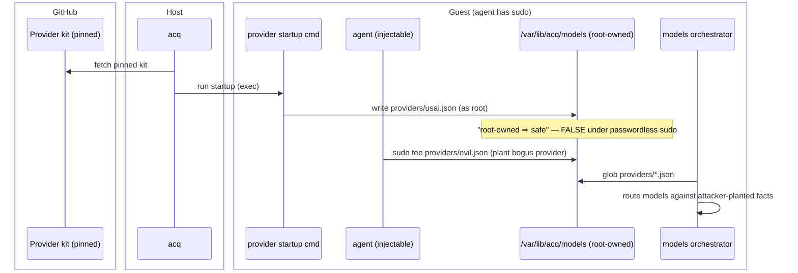
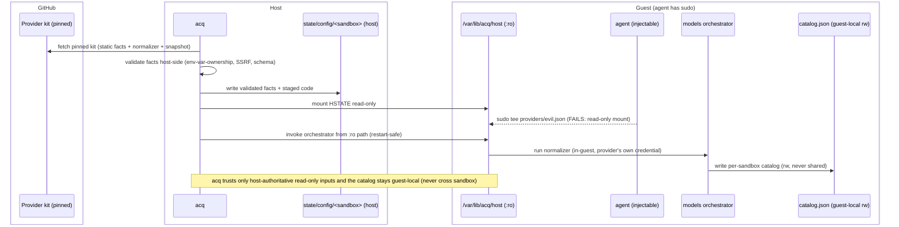

# ADR 0003 (isolation) — Neutral model-provider discovery: provider facts, a models orchestrator kit, and harness-owned rendering

> Area-scoped ADR for `integrations/isolation/`. Extends the neutral `hybrid/v1`
> kit spec (ADR 0001) and the network egress tiers (ADR 0002). Does not modify
> either schema; the mechanism described here composes from already-shipped
> primitives (`caps.network.allow` union, sequential kit startup) plus the
> host-authoritative read-only config mount defined in quickstart ADR-0030.

## Context and Problem Statement

Every harness kit that talks to a model provider (`usai-provider`/OpenCode,
`goose-server`, and future `pi-coding-agent`/others) currently hand-rolls its
own provider integration:

- `usai-provider` ships a hand-maintained `opencode.jsonc` model block, refreshed
  by a maintainer manually running `scripts/sync-usai-models.mjs` on the host and
  committing the result. `goose-server` (in flight) independently re-registers
  the **same USAi credential** under a **different** secret-store service name
  (`goose-usai` vs. `usai`, same host `api.gsa.usai.gov`) — confirmed by tracing
  `acq`'s secret store, which dedupes purely by service-name string, never by
  host (`acq.backends/secret-store.sh:92-114`). A user running both kits pastes
  the same USAi key in twice, with no cross-check if one copy is rotated and the
  other isn't.
- The two kits' "copy-on-first-boot, merge-without-clobbering on later boots"
  config-merge scripts (`usai-provider/files/home/usai-config/merge-global-config.mjs`,
  `goose-server/files/home/goose-config/merge-config.mjs`) are ~230-260 lines
  each, of which ~150-190 lines per kit are the same algorithm, hand-copied — the
  goose file's own header admits it "mirrors the usai-provider kit's
  merge-global-config.mjs."
- The bounded-fetch-with-timeout-and-size-cap helper (`fetchJsonBounded`) has
  already been copy-pasted once (`integrations/providers/usai/scripts/build-catalog.mjs`)
  and has already drifted — the copy gained 401/403 handling the original lacks.
- `pi-coding-agent` ships today with **zero** provider-config code
  (deliberately deferred; see its own README "Status" section) — a clean-slate
  case any new mechanism must also serve without a migration burden.
- The maintainer's stated direction (this session, 2026-09-17/18): kits should
  be mixed and matched (multiple provider kits, multiple harness kits, not a
  fixed 1:1 pairing), harness kits must own their own configuration lifecycle
  end-to-end (read from a neutral source, render their own native format —
  never a central kit rendering on a harness's behalf), and the staleness
  problem should be solved by an in-sandbox refresh at startup, with a
  vendored snapshot as the fallback — not by a human re-running a sync
  script and cutting a kit release every time a vendor adds a model.

This is a genuine, load-bearing extensibility problem now (`goose-server` is a
second real harness kit in flight; `pi-coding-agent` is a third with zero
provider code to migrate), not a speculative one for a hypothetical future
provider.

## Options Considered

Three shapes were evaluated via nexus-agents 7-role consensus panels before
this ADR was written (all three panel results are persisted in this session's
tool-memory and summarized in "Alternatives Considered" below):

1. **Live in-guest polling with no discovery mechanism.** Rejected 7-0. No way
   for a harness kit to know which provider kit(s) were present other than
   hardcoding a vendor name; no fallback/validation contract specified.
2. **Host-side polling: `acq` itself executes a normalizer script shipped
   inside a provider kit, on the host, next to real secret material, before any
   sandbox exists.** Split 4-3 approve. The rejecting votes converged on one
   sharp, correct objection: this is the first case in this codebase of
   executing third-party kit-shipped code **outside** the sandbox trust
   boundary, in the same host process that holds real credentials. Approving
   votes wanted this fixed, not the overall shape abandoned.
3. **In-guest polling, reusing the harness's own already-standing network +
   credential trust boundary** (this ADR's decision; the network/credential
   shape approved 5-2, with the facts/code *integrity* mechanism corrected
   post-review — see the correction note below). The two remaining rejections
   were specific and were incorporated into the design below rather than
   overridden:
   - **Contrarian Analyst**: the provider-facts self-registration file must not
     let a provider kit name an arbitrary credential env var it doesn't itself
     own (e.g. pointing at `GITHUB_TOKEN`) — the orchestrator must verify the
     named var is one the same provider kit declares in its own `environment:`
     block before ever reading it.
   - **Scope Steward**: don't build a multi-provider orchestration kit
     speculatively at N=1 real provider. The maintainer's explicit direction
     (goose-server + pi-coding-agent in flight, "we need it") supersedes this
     objection for this decision — recorded here per the ADR template's
     requirement to document dissent, not to relitigate it.

> **Post-review correction (PR #423, reviewer: mogul).** Round 3's design still
> had the provider kit *write* its facts file to a root-owned guest path and
> assumed that made it un-tamperable. Because `acq` grants the in-sandbox agent
> **passwordless sudo**, guest root-ownership is not a trust boundary against the
> agent. The self-registration mechanism was therefore moved from
> "kit writes in-guest" to "kit ships a static file; `acq` materializes it on the
> host and mounts it **read-only**" (Layer 1 below), and the shared host-side
> cache was dropped in favor of per-sandbox, guest-local catalog generation
> (Layer 2 below). The general principle and mount/exec mechanism are recorded in
> quickstart ADR-0030 (*Host-Authoritative Sandbox Configuration*).

## Decision

### Layer 1 — Provider kit self-registration (host-materialized, read-only)

A provider-role kit self-registers by **shipping a small, static JSON facts
file inside its own (pinned) kit directory** — declared, not generated. At
provision, `acq` reads that static file **on the host** (out of the kit
directory it already fetches and pins), validates it host-side (see "Security
hardening" below), and materializes it into a per-sandbox host directory that it
mounts **read-only** into the guest at a well-known path:

```
/var/lib/acq/host/models/providers/<PROVIDER_ID>.json   (read-only mount)
```

> **Corrected from an earlier draft (the PR #423 review's central finding).**
> An earlier draft had each provider kit *write* this facts file to a root-owned
> guest path in its own `startup` command, and claimed "root-owned, so it is not
> agent-writable." **That is false in this environment:** `acq` deliberately
> gives the in-sandbox agent **passwordless sudo** (the sandbox — not the guest
> OS user boundary — is the security boundary). A prompt-injected agent can
> `sudo tee /var/lib/acq/models/providers/evil.json` and plant a bogus provider,
> steering model routing. Guest root-ownership is not a trust boundary against
> the agent.
>
> The fix is to move the trust boundary to the only place that holds under
> sudo — the **host↔guest** boundary. `acq` produces the facts file on the host
> and presents it to the guest **read-only** (VMM/mount-enforced; guest sudo
> cannot override it). No provider-kit code runs on the host — `acq` reads a
> **static data file** only; the normalizer still runs in-guest (Layer 2). The
> general principle and the mount/exec mechanism are recorded in the quickstart
> repo's ADR-0030 (*Host-Authoritative Sandbox Configuration*), which this ADR
> is the first consumer of and references as the mechanism of record.

Facts file shape (v1):

```json
{
  "schemaVersion": "acq-provider-facts/v1",
  "providerId": "usai",
  "host": "api.gsa.usai.gov",
  "baseUrl": "https://api.gsa.usai.gov/api/v1",
  "modelsUrl": "https://api.gsa.usai.gov/api/v1/models",
  "keyEnv": "USAI_API_KEY"
}
```

**Env-var-ownership binding (Contrarian's fix, load-bearing):** `keyEnv` names
an environment variable. Before that named variable's value is ever read, the
SAME provider kit's own `spec.yaml` `environment:` block (or its
runtime-injected secret binding for that exact service) MUST declare that
variable name. A provider kit cannot name a credential it does not itself own.
This check is mechanical (string comparison against the provider kit's own
declared name), not a trust judgment call, and it runs **host-side** as part of
`acq`'s facts validation — before the facts file is materialized into the
read-only mount — so a tampered in-guest copy cannot bypass it (there is no
writable in-guest copy to tamper).

The provider kit also ships, inside its own kit directory (never centrally):

- Its own normalizer (raw vendor API response → the one neutral catalog
  schema below). The provider kit's own author knows its vendor's API shape
  best; no central kit accumulates per-vendor knowledge that rots.
- Its own vendored fallback snapshot — a small, committed, last-known-good
  model list used when live refresh fails. A bad fetch degrades to *that
  provider's* last-known-good list, not a central kit's stale idea of every
  vendor's list.

This directly fixes the secret-duplication problem in Context: a second
provider kit reaching the same vendor should reuse the SAME secret-store
service identity (keyed by provider, not invented per-harness), eliminating
the `usai` vs `goose-usai` double-registration.

### Layer 2 — Models orchestrator kit (new; core-repo candidate)

A new, vendor-agnostic kit, placed early in kit order (after provider kits,
before harness kits — the same positional-ordering convention already used to
guarantee `zscaler-ca-certificate` runs before kits that need its CA trust;
see `acq.backends/common.sh:47-58` and its bats-asserted invariant at
`test/bats/50-kit-list-completeness.bats:26-28`). Its `startup` phase:

1. Globs the **read-only** provider-facts mount
   `/var/lib/acq/host/models/providers/*.json` (Layer 1).
2. For each discovered provider, invokes that provider's own normalizer via a
   shared, vendored-into-this-kit bounded-fetch helper (timeout + response-size
   cap — the same contract as today's `fetchJsonBounded`, now with one canonical
   implementation instead of two already-drifted copies).
3. Validates the normalizer's OUTPUT (not just the fetch) against the neutral
   catalog schema before accepting it — Security Engineer's condition: remote
   response data must never be trusted merely for connecting successfully; a
   structurally-valid-but-wrong response is still a routing hazard, so shape
   validation is mandatory on every refresh, not just on error paths.
4. On ANY failure (timeout, oversized, malformed, validation failure, no
   provider present) falls back to that provider's own vendored snapshot
   (shipped in the provider kit, presented on the same read-only mount).
5. Aggregates every provider's neutral output into one **guest-local,
   per-sandbox** file, written read-write and never shared with any other
   sandbox: `/var/lib/acq/models/catalog.json`.
6. Records provenance per provider (`"source": "live" | "snapshot"`, with a
   timestamp) in the aggregate — DevEx's condition: a permanently degraded
   fallback must be visible, not silently indistinguishable from a fresh fetch.

This kit carries **zero vendor-specific knowledge** — it is pure orchestration
(glob, invoke, validate, fall back, aggregate). That is what makes it a
credible candidate for promotion to a widely-reused core kit: a third-party
provider kit needs zero PRs accepted into this kit or into any central catalog
file to work with it.

**No shared host-side cache (maintainer decision, corrected from an earlier
draft).** An earlier draft cached the aggregated catalog on a **host-mounted
volume shared across sandboxes** to make a TTL meaningful across `acq run`
invocations. That is **dropped**: a cache written by one sandbox and read by
another is a cross-sandbox tampering channel — a compromised sandbox could
poison the catalog a *different* sandbox routes against. The catalog is instead
**generated per-sandbox at startup** and kept **guest-local** to that sandbox
(`/var/lib/acq/models/catalog.json`, read-write, owned by the sandbox that
produced it). It is authoritative only within its own sandbox and dies with it.
The freshness/TTL machinery and the host cache volume are removed entirely; the
deepest fallback is the provider kit's vendored snapshot on the read-only mount.
The **inputs** the orchestrator trusts — the provider facts and the normalizer
code — are host-authoritative and read-only (Layer 1 + ADR-0030); its **output**
(the catalog) is guest-local and never trusted by any other sandbox.

> **Startup integrity across restarts.** The orchestrator's own code (and each
> provider's normalizer + vendored snapshot) is staged from the pinned kit
> directory into the same per-sandbox **read-only** mount and invoked from
> there by `acq`'s restart heal — so a sudo-capable agent cannot tamper the
> startup code between restarts and have `acq` re-run the tampered copy. This is
> Mechanism 2 of quickstart ADR-0030 (trusted startup execution from the `:ro`
> mount); the alternatives considered (re-push-on-heal with its TOCTOU window;
> msb `--script-path` native replay, which ADR-0017 showed is inert at boot) are
> recorded there.

### Layer 3 — Harness kit owns its own rendering (unchanged from prior guidance)

Each harness kit, at its own `startup` phase (after the models kit, per the
same positional-ordering convention), reads:

- `/var/lib/acq/models/catalog.json` (Layer 2's neutral aggregate — the
  per-sandbox, guest-local file produced this boot), and
- The config kit's cross-harness defaults (model-role priority, etc. — Tier 3
  from prior design work, unchanged, still deferred: a neutral **permission**
  vocabulary stays out of scope until a second harness kit's *native*
  permission model is in hand, per the unanimous guidance from the first
  consensus panel in this session),

and renders its OWN native config in its OWN format. The harness kit owns its
full configuration lifecycle end-to-end — it is the only thing that knows how
to turn a neutral model list into `opencode.jsonc`, or into goose's
`custom_usai.json`, or into a future `pi` config. No central kit renders on a
harness's behalf.

This yields **N provider normalizers + M harness renderers**, not
**N×M** per-pair emitters (today's actual pattern once `goose-server` lands:
`emitters/opencode.mjs`, `emitters/prime-agent.mjs`, `emitters/goose.mjs`, each
independently re-deriving "read catalog, select models, transform pricing").

### Neutral catalog schema — versioned now, no negotiation mechanism (per maintainer decision)

The schema is versioned from v1 (`schemaVersion: "acq-neutral-model-catalog/v1"`
on every normalizer's output and the aggregate file). Per the maintainer's
explicit decision: ship v1 now; do not build a multi-version negotiation
mechanism (renderers declaring supported versions, the orchestrator picking
compatible pairings) ahead of a real second version existing. If a breaking
change is ever needed, it is a coordinated bump documented in a follow-up ADR
at that time — accepted as a rare cost given model catalogs are a simple,
slow-moving shape (id / context window / pricing / vendor).

### Security hardening (both panels' conditions, binding)

- **Host-authoritative, guest-read-only inputs** (this ADR's central
  correction; quickstart ADR-0030): provider facts and normalizer/orchestrator
  code are materialized by `acq` on the host from the pinned kit directory and
  mounted **read-only** into the guest. A prompt-injected, sudo-capable agent
  cannot plant a bogus provider, tamper a normalizer, or rewrite startup code —
  the mount is read-only at the VMM/mount layer, which guest sudo cannot
  override. `acq` reads only **static data** from the kit on the host; no
  provider-kit code executes on the host.
- **No shared/cross-sandbox state**: the catalog is generated per-sandbox at
  startup and kept guest-local; nothing a sandbox writes is read by another
  sandbox. This removes the cross-sandbox poisoning channel a shared host cache
  would introduce.
- **Env-var-ownership binding** (Contrarian): enforced host-side as described in
  Layer 1.
- **SSRF hardening** (Security Engineer, Contrarian): `modelsUrl` must be
  `https://` and its host must equal the facts file's own declared `host`,
  which must itself be on the sandbox's already-effective `caps.network.allow`
  union (ADR 0002) — the orchestrator never fetches an arbitrary URL a facts
  file supplies without this cross-check.
- **No new credential exposure to the models kit itself.** The models kit
  invokes each provider's normalizer with that provider's already-bound
  credential exactly as the provider kit would use it for its own inference
  calls — reusing the standing trust boundary, not creating a new one. The
  models kit's own code never sees plaintext key material beyond what the
  guest's existing secret-injection mechanism already exposes to that
  specific, already-network-permitted host.
- **Atomicity.** Facts and aggregate writes are temp-file + rename; no reader
  ever observes a partial write.
- **Bounded resource use.** Per-provider fetch timeout + response-size cap
  (shared helper, single canonical implementation); a total wall-clock budget
  across all discovered providers so a slow/hanging endpoint cannot stall
  sandbox startup indefinitely.
- **Pinning.** Provider and harness kits remain SHA-pinned per this
  repo's existing kit-reference discipline; no floating refs.

## Trust-boundary flows

Participants: **GitHub** (pinned kit source), **Host** (`acq` + real
credentials + the state tree), **Guest** (the microVM/container; the agent has
passwordless sudo).

### Rejected — provider kit writes facts in the guest (the PR #423 finding)



### Chosen — host-materialized facts + code, guest read-only



## Consequences

### Positive

- **Closes the PR #423 finding:** a prompt-injected, sudo-capable agent can no
  longer plant/forge provider facts or tamper the normalizer/startup code that
  `acq` re-runs — the trust boundary is the host↔guest read-only mount, not
  guest root-ownership.
- Collapses the confirmed secret-duplication bug (two service-name
  registrations for one USAi credential) into one canonical per-(vendor)
  registration.
- Collapses ~150-190 duplicated merge-script lines per harness kit and the
  already-drifted duplicate bounded-fetch helper into one shared,
  Tier-0-style library.
- A third-party provider kit needs zero PRs accepted into any core-maintained
  file to work with any existing harness kit, and vice versa — removes the
  central-maintainer bottleneck the maintainer explicitly wants gone.
- `pi-coding-agent` and any future harness kit adopt this as a clean, greenfield
  integration (read the aggregate, render your own config) with no migration
  burden.
- Model lists refresh without a human re-running a sync script and cutting a kit
  release, while remaining fully functional and deterministic offline (fall back
  to the provider's vendored snapshot).

### Negative / risks

- New moving parts: a per-sandbox host config directory + read-only mount, a new
  orchestrator kit, a versioned schema contract between N producers and M
  consumers. Mitigated by strict layering (each layer independently testable and
  shippable), by reusing the existing host-state-dir conventions (quickstart
  ADR-0030), and by the versioned-not-negotiated schema decision above.
- Sandbox startup now has a conditional outbound step (the orchestrator's live
  refresh) on the critical path. Bounded by per-provider timeout
  + a total wall-clock budget; on any failure it falls back to the provider's
  vendored snapshot (a fast local read), so a slow/unreachable endpoint degrades
  rather than stalls.
- Rendered harness config is no longer a pure function of pinned kit refs alone
  — it also depends on live-vs-snapshot state at boot time. Accepted, with the
  snapshot fallback and per-provider provenance recording making any degraded
  state visible rather than silent.

### Neutral

- Requires no change to the `hybrid/v1` schema itself — the entire mechanism
  composes from already-shipped primitives (`caps.network.allow` union,
  sequential startup-phase ordering) plus the host-authoritative read-only
  config mount defined in quickstart ADR-0030.

## Alternatives Considered

- **Host-side execution of provider-shipped normalizer code** (Option 2
  above). Rejected: puts untrusted, pinned-but-not-sandboxed third-party code
  in the same host process as real secret material, before any sandbox trust
  boundary exists. This was the deciding factor in a 4-3 split vote; moving
  everything in-guest (this ADR's decision) was independently re-evaluated at
  5-2 approve once this objection was removed.
- **No discovery mechanism; hardcode one vendor per harness kit** (Option 1,
  status quo). Rejected 7-0 in an earlier round of this same design work: no
  way for a harness kit to learn which provider kit(s) are present without a
  hardcoded name per pairing: reproduces the N×M problem this ADR exists to
  retire.
- **Defer entirely until a second real provider kit ships** (Scope Steward's
  dissent, both rounds). Not adopted: the maintainer's explicit direction is
  that `goose-server` and `pi-coding-agent` are in flight now and this
  extensibility problem is real today, not speculative. Recorded per the ADR
  template's dissent-recording convention, not relitigated.
- **A neutral, harness-agnostic permission vocabulary as part of this same
  ADR.** Deferred, unchanged from the first consensus panel's unanimous
  guidance this session: exactly one real consumer exists today (OpenCode's
  permission map); build the concrete translator when a second harness's
  genuinely different native permission model is in hand, not before.

## What an agent must NOT decide unilaterally

- The neutral catalog schema's field set once a second real provider exists —
  that is a cross-repo contract change and needs the same review process as
  ADR 0002's `caps.network.allow` baseline.
- Whether the models orchestrator kit is promoted into any "core, always-on"
  built-in kit bundle — that is a decision about default behavior for every
  user, analogous to ADR 0002's "what belongs on the federally-shipped
  `balanced` allowlist," and needs the same human/CODEOWNERS review.

## References

- Quickstart ADR-0030 (*Host-Authoritative Sandbox Configuration*) — the
  general principle and the per-sandbox host config dir + read-only mount +
  trusted-startup-execution mechanism this ADR's Layer 1/Layer 2 build on;
  the mechanism of record for the PR #423 correction.
- ADR 0001 (isolation) — neutral `hybrid/v1` acq-kits spec.
- ADR 0002 (isolation) — neutral network egress tiers; `caps.network.allow`
  union this ADR reuses as the SSRF-hardening cross-check and as the existing
  trust boundary this design deliberately does not widen.
- `usai-provider` ADR 0003 (`acq-kits/usai-provider/docs/decisions/`) —
  the permission-hardening precedent this design's security conditions follow.
- `goose-server` ADR 0004 (in flight, `origin/goose-kit` branch) — records the
  same harness-adapter-layer open questions this ADR's Layer 3 boundary
  answers for the model-config slice specifically.
- Consensus panels (this session, 2026-09-17/18, nexus-agents `consensus_vote`,
  `higher_order` strategy, 7 roles): round 1 (live-poll, no discovery) 7-0
  reject; round 2 (host-side execution) 4-3 approve; round 3 (in-guest,
  reusing standing trust boundary) 5-2 approve — this ADR implements round 3's
  design with round 3's dissent conditions incorporated.
