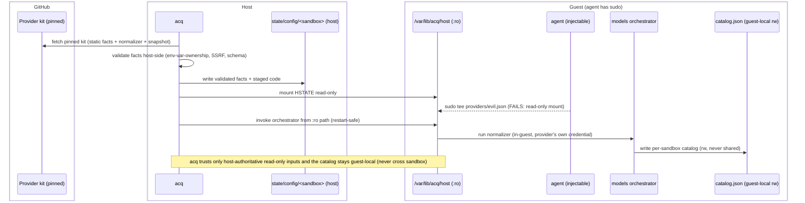

# ADR 0003 (isolation) — Neutral model-provider discovery: provider facts, a models orchestrator kit, and harness-owned rendering

> Area-scoped ADR for `integrations/isolation/`. Extends the neutral `hybrid/v1`
> kit spec (ADR 0001) and the network egress tiers (ADR 0002). It changes neither
> schema; the mechanism composes from already-shipped primitives
> (`caps.network.allow` union, sequential kit startup) plus the
> host-authoritative read-only config mount defined in quickstart ADR-0030.

## Context and Problem Statement

Kits are mixed and matched: a sandbox may carry more than one **provider** kit
(which knows a vendor's model API) and more than one **harness** kit (which
configures an agent — OpenCode, goose, `pi-coding-agent`), in any combination,
not a fixed 1:1 pairing. Without a discovery mechanism, every harness kit has to
hand-roll its own provider integration, which produces three recurring problems:

- **Duplicated credential registration.** Two harness kits reaching the same
  vendor register the same credential twice under different secret-store service
  names, because `acq`'s secret store dedupes by service-name string, never by
  host (`acq.backends/secret-store.sh`). A user pastes the same key in twice and
  nothing cross-checks the two copies when one is rotated.
- **Duplicated config-merge code.** Each harness kit re-implements the same
  "copy-on-first-boot, merge-without-clobbering-on-later-boots" algorithm
  (~150–190 lines per kit) and the same bounded-fetch-with-timeout-and-size-cap
  helper, hand-copied between kits and prone to drift.
- **Manual, release-coupled model refresh.** A model list is refreshed only when
  a maintainer runs a sync script on the host and cuts a kit release, so the
  catalog goes stale between releases.

The design goals that follow:

- A harness kit learns which provider kit(s) are present **without hardcoding a
  vendor name**.
- Each harness kit **owns its own configuration lifecycle end to end**: it reads
  a neutral model catalog and renders its own native config; no central kit
  renders on a harness's behalf.
- Model lists **refresh in-sandbox at startup**, with a vendored snapshot as the
  offline fallback, so no human re-runs a sync script and cuts a release for
  every vendor model change.
- Adding a provider or harness costs **N + M** integrations (N provider
  normalizers + M harness renderers), not **N × M** per-pair emitters.

## Decision

Three layers, composing from already-shipped primitives. No `hybrid/v1` schema
change is required.

### Layer 1 — Provider kit self-registration (host-materialized, read-only)

A provider-role kit ships a small, static JSON **facts file** inside its own
(pinned) kit directory. At provision, `acq` reads that static file **on the
host**, validates it host-side (see [Security model](#security-model)), and
materializes it into a per-sandbox host directory that it mounts **read-only**
into the guest at a well-known path:

```text
/var/lib/acq/host/models/providers/<PROVIDER_ID>.json   (read-only mount)
```

Facts file shape (v1):

```json
{
  "schemaVersion": "acq-provider-facts/v1",
  "providerId": "usai",
  "host": "api.gsa.usai.gov",
  "baseUrl": "https://api.gsa.usai.gov/api/v1",
  "modelsUrl": "https://api.gsa.usai.gov/api/v1/models",
  "keyEnv": "USAI_API_KEY"
}
```

The facts file is **host-authoritative and read-only in the guest**: `acq`
produces it on the host from the pinned kit and presents it to the guest through
a read-only mount that the VMM/mount layer enforces. This is why the file is not
written by an in-guest `startup` command — the in-sandbox agent has passwordless
sudo (the sandbox, not the guest OS user boundary, is the security boundary), so
a root-owned *guest* path is not a trust boundary against a prompt-injected
agent. The read-only host mount is. `acq` reads only **static data** from the
kit on the host; no provider-kit code runs on the host. See
[Security model](#security-model) and quickstart ADR-0030
(*Host-Authoritative Sandbox Configuration*), the mechanism of record.

`keyEnv` names the environment variable that holds the vendor credential. A
provider kit may only name a credential it declares itself: `acq` confirms
`keyEnv` matches a variable in the same provider kit's own `spec.yaml`
`environment:` block (or its runtime-injected secret binding for that service)
before that variable is ever read. This check is a mechanical string comparison,
runs host-side as part of facts validation, and prevents a kit from naming an
unrelated credential (e.g. `GITHUB_TOKEN`).

Each provider kit also ships, inside its own kit directory (never centrally):

- its **normalizer** — code that maps the raw vendor API response to the neutral
  catalog schema. The vendor's own author knows its API shape best, so no central
  kit accumulates per-vendor knowledge that rots; and
- a **vendored fallback snapshot** — a small, committed, last-known-good model
  list used when a live refresh fails, so a bad fetch degrades to *that
  provider's* last-known-good list.

Keying the credential by provider (not by harness) means a second harness kit
reaching the same vendor reuses the same secret-store service identity,
eliminating the double-registration described in Context.

### Layer 2 — Models orchestrator kit (vendor-agnostic)

A single vendor-agnostic kit runs early in kit order — after provider kits,
before harness kits — using the same positional-ordering convention that already
guarantees `zscaler-ca-certificate` runs before kits that need its CA trust
(`acq.backends/common.sh`, asserted in `test/bats/50-kit-list-completeness.bats`).
Its `startup` phase:

1. Globs the read-only provider-facts mount
   `/var/lib/acq/host/models/providers/*.json` (Layer 1).
2. For each discovered provider, invokes that provider's own normalizer through a
   shared, vendored-into-this-kit bounded-fetch helper (per-provider timeout +
   response-size cap), with one canonical implementation of that helper.
3. Validates the normalizer's **output** against the neutral catalog schema
   before accepting it — a structurally-valid-but-wrong response is still a
   routing hazard, so shape validation runs on every refresh, not only on error
   paths.
4. On any failure (timeout, oversized, malformed, validation failure, or no
   provider present) falls back to that provider's vendored snapshot, presented
   on the same read-only mount.
5. Aggregates every provider's neutral output into one **guest-local,
   per-sandbox** file, written read-write and never shared with any other
   sandbox: `/var/lib/acq/models/catalog.json`.
6. Records provenance per provider (`"source": "live" | "snapshot"`, with a
   timestamp) in the aggregate, so a permanently degraded fallback is visible
   rather than indistinguishable from a fresh fetch.

The orchestrator carries **zero vendor-specific knowledge** — it is pure
orchestration (glob, invoke, validate, fall back, aggregate). A third-party
provider kit therefore works with it without any PR into this kit or into a
central catalog file.

The catalog is **guest-local and per-sandbox**: it is generated fresh at each
sandbox's startup and is authoritative only within the sandbox that produced it.
There is no cross-sandbox catalog cache — a cache written by one sandbox and read
by another would be a cross-sandbox poisoning channel (a compromised sandbox
could poison the catalog a different sandbox routes against). The clean split is:
the orchestrator's **inputs** (provider facts and normalizer code) are
host-authoritative and read-only (Layer 1 + ADR-0030); its **output** (the
catalog) is guest-local and trusted by no other sandbox.

The orchestrator's own code, and each provider's normalizer and vendored
snapshot, run from the read-only mount (ADR-0030 Mechanism 2), so a sudo-capable
agent cannot tamper the startup code between restarts and have `acq` re-run a
tampered copy.

> **Open ordering risk, not yet resolved by this ADR:** the catalog write
> (Layer 2) and the harness's own render (Layer 3) are both ordinary in-guest
> `startup`-phase writes. Quickstart's kit-reference docs state, and live
> reproduction against `sbx` v0.43.0 confirms, that a backend's agent
> entrypoint launches once `startup` commands are *dispatched*, not once they
> finish — `acq`'s pre-attach readiness check only confirms the agent binary
> is executable, not that any kit's config write has completed. This already
> affects the shipped `usai-provider` config-merge step; Layers 2–3 add two
> more sequential writes ahead of the same entrypoint. The read-only mount
> above hardens this pipeline's *inputs*; it does not guarantee the *harness's
> config file* is complete before the harness first reads it.

### Layer 3 — Harness kit owns its own rendering

Each harness kit, at its own `startup` phase (after the orchestrator, per the
same ordering convention), reads:

- `/var/lib/acq/models/catalog.json` — Layer 2's neutral aggregate for this
  sandbox; and
- the config kit's cross-harness defaults (model-role priority, etc.).

It then renders its **own** native config in its own format — `opencode.jsonc`,
goose's `custom_usai.json`, a future `pi` config — because only the harness knows
how to turn a neutral model list into its native shape. No central kit renders on
a harness's behalf.

This is what yields **N provider normalizers + M harness renderers** rather than
**N × M** per-pair emitters that each re-derive "read catalog, select models,
transform pricing."

### Neutral catalog schema

Both a normalizer's output and the aggregate carry
`schemaVersion: "acq-neutral-model-catalog/v1"`. The schema is versioned from v1;
there is no multi-version negotiation mechanism (renderers declaring supported
versions, the orchestrator picking compatible pairings). A model catalog is a
simple, slow-moving shape (id / context window / pricing / vendor), so a breaking
change is handled as a rare, coordinated version bump documented in a follow-up
ADR at that time, not by standing negotiation machinery.

## Security model

- **Host-authoritative, guest-read-only inputs.** Provider facts and
  normalizer/orchestrator code are materialized by `acq` on the host from the
  pinned kit directory and mounted read-only into the guest. A prompt-injected,
  sudo-capable agent cannot plant a bogus provider, tamper a normalizer, or
  rewrite startup code, because the mount is read-only at the VMM/mount layer.
  `acq` reads only static data from the kit on the host; no provider-kit code
  executes on the host (see [Alternatives](#alternatives-considered) for why
  host-side execution is excluded).
- **No cross-sandbox state.** The catalog is generated per-sandbox and kept
  guest-local; nothing one sandbox writes is read by another.
- **Env-var ownership.** A provider kit may only name a credential (`keyEnv`) it
  declares in its own `spec.yaml`; enforced host-side (Layer 1).
- **SSRF containment.** `modelsUrl` must be `https://` and its host must equal
  the facts file's declared `host`, which must itself be on the sandbox's
  effective `caps.network.allow` union (ADR 0002). The orchestrator never fetches
  an arbitrary URL a facts file supplies.
- **No new credential exposure.** The orchestrator invokes each provider's
  normalizer with that provider's already-bound credential, exactly as the
  provider kit would for its own inference calls — reusing the standing trust
  boundary, not creating a new one. The orchestrator's own code never sees
  plaintext key material beyond what the guest's existing secret-injection
  mechanism already exposes to that specific, network-permitted host.
- **Atomic writes.** Facts and aggregate writes are temp-file + rename; no reader
  observes a partial write.
- **Bounded resource use.** Per-provider fetch timeout + response-size cap
  (one shared implementation) and a total wall-clock budget across providers, so
  a slow or hanging endpoint cannot stall sandbox startup.
- **Pinning.** Provider and harness kits are SHA-pinned per the repo's kit-ref
  discipline; no floating refs.

## Trust-boundary flow

Participants: **GitHub** (pinned kit source), **Host** (`acq` + real credentials
+ the state tree), **Guest** (the microVM/container; the agent has passwordless
sudo). The trust boundary is the host↔guest read-only mount: facts and code are
materialized on the host and presented read-only, so a guest `sudo` write fails,
while the catalog the orchestrator produces stays guest-local.



## Consequences

### Positive

- A prompt-injected, sudo-capable agent cannot plant or forge provider facts, or
  tamper the normalizer/startup code `acq` re-runs — the trust boundary is the
  host↔guest read-only mount, not guest root-ownership.
- One canonical per-vendor credential registration replaces the duplicate
  service-name registrations described in Context.
- One shared config-merge/bounded-fetch library replaces the per-kit copies.
- A third-party provider or harness kit integrates with no PR into a
  core-maintained file — there is no central-maintainer bottleneck.
- New harness kits (e.g. `pi-coding-agent`) adopt this as a greenfield
  integration: read the aggregate, render your own config.
- Model lists refresh without a human re-running a sync script and cutting a kit
  release, while remaining functional and deterministic offline via the vendored
  snapshot.

### Negative / risks

- New moving parts: a per-sandbox host config directory + read-only mount, an
  orchestrator kit, and a versioned schema contract between N producers and M
  consumers. Mitigated by strict layering (each layer independently testable and
  shippable), reuse of the existing host-state-dir conventions (ADR-0030), and
  the versioned-not-negotiated schema.
- Startup gains a conditional outbound refresh on the critical path, bounded by
  the per-provider timeout and total wall-clock budget; on failure it falls back
  to the vendored snapshot (a fast local read), so a slow or unreachable endpoint
  degrades rather than stalls.
- Rendered harness config is no longer a pure function of pinned kit refs alone —
  it also depends on live-vs-snapshot state at boot. The snapshot fallback and
  per-provider provenance recording make any degraded state visible rather than
  silent.
- **Standing startup-ordering gap, inherited not introduced by this ADR** — see
  the Layer 2 callout above. Affects the shipped `usai-provider` config-merge
  step too; Layers 2–3 add to the same exposure rather than create it.

### Neutral

- Requires no change to the `hybrid/v1` schema. The mechanism composes from the
  `caps.network.allow` union, sequential startup-phase ordering, and the
  host-authoritative read-only config mount from quickstart ADR-0030.

## Alternatives Considered

- **Host-side execution of provider-shipped normalizer code.** Excluded: it puts
  pinned-but-unsandboxed third-party code in the same host process as real secret
  material, before any sandbox trust boundary exists. Running the normalizer
  in-guest (this ADR) keeps third-party code inside the sandbox boundary while
  still using the read-only mount for the code's *integrity*.
- **No discovery mechanism; hardcode one vendor per harness kit.** Excluded: a
  harness kit could not learn which provider kit(s) are present without a
  hardcoded name per pairing, reproducing the N × M problem this ADR retires.
- **A shared, cross-sandbox host catalog cache with a TTL.** Excluded: a cache
  written by one sandbox and read by another is a cross-sandbox poisoning
  channel. The catalog is per-sandbox and guest-local instead; the vendored
  snapshot is the offline fallback.
- **A neutral, harness-agnostic permission vocabulary in this ADR.** Deferred:
  one real consumer exists today (OpenCode's permission map). The concrete
  translator is warranted only when a second harness's genuinely different native
  permission model is in hand.

## What an agent must NOT decide unilaterally

- The neutral catalog schema's field set once a second real provider exists —
  that is a cross-repo contract change and needs the same review process as
  ADR 0002's `caps.network.allow` baseline.
- Whether the models orchestrator kit becomes a "core, always-on" built-in — that
  changes default behavior for every user (analogous to ADR 0002's federally
  shipped `balanced` allowlist) and needs human/CODEOWNERS review.
- **The startup-ordering gap's fix.** Belongs upstream as a general completion
  barrier in `acq`'s provision→attach sequencing (mirroring what already,
  incidentally, closes it on `msb`) — not a per-kit workaround here, which
  would just be a second, divergent mechanism. Quickstart-owned; needs
  quickstart maintainer review.

## References

- Quickstart ADR-0030 (*Host-Authoritative Sandbox Configuration*) — the general
  principle and the per-sandbox host config dir + read-only mount +
  trusted-startup-execution mechanism this ADR's Layers 1 and 2 build on.
- ADR 0001 (isolation) — neutral `hybrid/v1` acq-kits spec.
- ADR 0002 (isolation) — neutral network egress tiers; the `caps.network.allow`
  union this ADR reuses for the SSRF host cross-check and as the trust boundary
  it does not widen.
- `usai-provider` ADR 0003 (`acq-kits/usai-provider/docs/decisions/`) — the
  permission-hardening precedent this design's security conditions follow.
- `goose-server` ADR 0004 — the harness-adapter open questions this ADR's Layer 3
  boundary answers for the model-config slice.
- Quickstart [issue #506](https://github.com/GSA-TTS/agentic-coding-quickstart/issues/506)
  tracking the startup-ordering race flagged above (`acq run` does not wait
  for an in-guest `startup`-phase config write to finish before attach,
  reproduced live against `sbx` v0.43.0) — the upstream fix this ADR's
  Layers 2–3 depend on but do not themselves provide.
