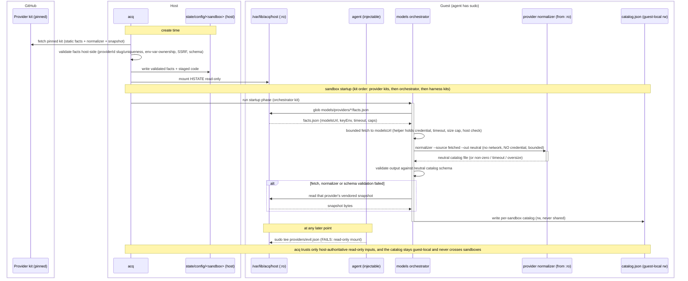

# ADR 0004 (isolation) — Neutral model-provider discovery: provider facts, a models orchestrator kit, and harness-owned rendering

> Area-scoped ADR for `integrations/isolation/`. Extends the neutral `hybrid/v1`
> kit spec (ADR 0001) and the network egress tiers (ADR 0002). It changes neither
> schema; the mechanism composes from already-shipped primitives
> (`caps.network.allow` union, sequential kit startup) plus the
> host-authoritative read-only config mount defined in quickstart ADR-0035
> (pending — GSA-TTS/agentic-coding-quickstart#504).

## Context and Problem Statement

Kits are mixed and matched: a sandbox may carry more than one **provider** kit
(which knows a vendor's model API) and more than one **harness** kit (which
configures an agent — OpenCode, goose, `pi-coding-agent`), in any combination,
not a fixed 1:1 pairing. Without a discovery mechanism, every harness kit has to
hand-roll its own provider integration, which produces three recurring problems:

- **Duplicated credential registration.** Two harness kits reaching the same
  vendor register the same credential twice under different secret-store service
  names, because `acq`'s secret store dedupes by service-name string, never by
  host (`acq.backends/secret-store.sh`). A user pastes the same key in twice and
  nothing cross-checks the two copies when one is rotated.
- **Duplicated config-merge code.** Each harness kit re-implements the same
  "copy-on-first-boot, merge-without-clobbering-on-later-boots" algorithm
  (~150–190 lines per kit) and the same bounded-fetch-with-timeout-and-size-cap
  helper, hand-copied between kits and prone to drift.
- **Manual, release-coupled model refresh.** A model list is refreshed only when
  a maintainer runs a sync script on the host and cuts a kit release, so the
  catalog goes stale between releases.

The design goals that follow:

- A harness kit learns which provider kit(s) are present **without hardcoding a
  vendor name**.
- Each harness kit **owns its own configuration lifecycle end to end**: it reads
  a neutral model catalog and renders its own native config; no central kit
  renders on a harness's behalf.
- Model lists **refresh in-sandbox at startup**, with a vendored snapshot as the
  offline fallback, so no human re-runs a sync script and cuts a release for
  every vendor model change.
- Adding a provider or harness costs **N + M** integrations (N provider
  normalizers + M harness renderers), not **N × M** per-pair emitters.

## Decision

Three layers, composing from already-shipped primitives. No `hybrid/v1` schema
change is required.

### Layer 1 — Provider kit self-registration (host-materialized, read-only)

A provider-role kit ships a small, static JSON **facts file**, a **normalizer**
entrypoint, and a **vendored fallback snapshot**, all inside its own (pinned)
kit directory. At provision, `acq` reads those static artifacts **on the
host**, validates the facts file host-side (see
[Security model](#security-model)), and materializes all three into a
per-sandbox host directory that it mounts **read-only** into the guest as a
fixed per-provider layout at a well-known path:

```text
/var/lib/acq/host/models/providers/<PROVIDER_ID>/   (read-only mount)
├── facts.json     # 6-field facts shape (v1), below
├── normalizer     # provider's normalizer entrypoint (executable)
└── snapshot.json  # provider's vendored fallback snapshot
```

`facts.json` shape (v1):

```json
{
  "schemaVersion": "acq-provider-facts/v1",
  "providerId": "usai",
  "host": "api.gsa.usai.gov",
  "baseUrl": "https://api.gsa.usai.gov/api/v1",
  "modelsUrl": "https://api.gsa.usai.gov/api/v1/models",
  "keyEnv": "USAI_API_KEY"
}
```

The facts file is **host-authoritative and read-only in the guest**: `acq`
produces it on the host from the pinned kit and presents it to the guest through
a read-only mount that the VMM/mount layer enforces. This is why the file is not
written by an in-guest `startup` command — the in-sandbox agent has passwordless
sudo (the sandbox, not the guest OS user boundary, is the security boundary), so
a root-owned *guest* path is not a trust boundary against a prompt-injected
agent. The read-only host mount is. `acq` reads only **static data** from the
kit on the host; no provider-kit code runs on the host. See
[Security model](#security-model) and quickstart ADR-0035
(*Host-Authoritative Sandbox Configuration*, pending —
GSA-TTS/agentic-coding-quickstart#504), the mechanism of record.

`providerId` is used as a **filesystem path segment** — it names the
materialized directory `/var/lib/acq/host/models/providers/<PROVIDER_ID>/` — so
it is validated host-side as a path component before any directory is created,
not merely as a schema string. The invariant:

- **Safe slug.** `providerId` MUST match `[a-z0-9]([a-z0-9-]{0,30}[a-z0-9])?`
  **against the whole string**: lowercase ASCII alphanumerics and internal
  hyphens, 1–32 characters. This rejects path separators (`/`, `\`),
  traversal segments (`.`, `..`), absolute paths, NUL and control bytes,
  leading/trailing hyphens, whitespace, and any non-ASCII character (so
  visually-confusable Unicode cannot impersonate another provider's directory
  name).

  The match MUST be whole-string — `fullmatch` semantics, or an explicitly
  newline-safe anchor such as `\A…\z`. A plain `^…$` is **not** sufficient: in
  Python, JavaScript, PCRE and `grep` alike, `$` matches before a trailing
  newline, so `^[a-z0-9]…$` accepts `"usai\n"`, which would then be used to
  create a directory name containing an embedded newline. Verified:
  `re.match(r'^[a-z0-9]([a-z0-9-]{0,30}[a-z0-9])?$', 'usai\n')` matches while
  `re.fullmatch(...)` does not. Implementations MUST also reject a `providerId`
  that is not a JSON string — a number or `null` must never be coerced into a
  path segment.
- **Matches its own directory.** The validated `providerId` MUST equal the name
  of the directory `acq` materializes for it, and the orchestrator MUST derive
  each provider's identity from the **directory name it globbed**, cross-checked
  against the `providerId` inside that directory's `facts.json`. A mismatch is a
  hard failure for that provider, not a warning: it means the two sources of
  identity disagree, and neither can be trusted to select the right credential.
- **Unique within the materialized set.** Two provider kits MUST NOT resolve to
  the same `providerId`. `acq` fails provisioning on a collision rather than
  letting the later kit overwrite the earlier one's `facts.json`, `normalizer`,
  or `snapshot.json` — a silent overwrite would let one kit substitute its own
  code and routing for another's while keeping that other's `keyEnv`.

Validation runs host-side, before materialization, in the same pass as the
checks below. A facts file failing it is rejected and that provider is absent
from the mount — which the orchestrator treats as "no provider present"
(Layer 2, step 4), never as a provider with a default identity.

`keyEnv` names the environment variable that holds the vendor credential. A
provider kit may only name a credential it declares itself: `acq` confirms
`keyEnv` matches a variable in the same provider kit's own `spec.yaml`
`environment:` block (or its runtime-injected secret binding for that service)
before that variable is ever read. This check is a mechanical string comparison,
runs host-side as part of facts validation, and prevents a kit from naming an
unrelated credential (e.g. `GITHUB_TOKEN`).

Each provider kit also ships, inside its own kit directory (never centrally),
as siblings of `facts.json` in the materialized `<PROVIDER_ID>/` directory
above:

- `normalizer` — code that maps the raw vendor API response to the neutral
  catalog schema. The vendor's own author knows its API shape best, so no central
  kit accumulates per-vendor knowledge that rots; and
- `snapshot.json` — a small, committed, last-known-good model list used when a
  live refresh fails, so a bad fetch degrades to *that provider's*
  last-known-good list.

Keying the credential by provider (not by harness) means a second harness kit
reaching the same vendor reuses the same secret-store service identity,
eliminating the double-registration described in Context.

### Layer 2 — Models orchestrator kit (vendor-agnostic)

A single vendor-agnostic kit runs early in kit order — after provider kits,
before harness kits — using the same positional-ordering convention that already
guarantees `zscaler-ca-certificate` runs before kits that need its CA trust
(`acq.backends/common.sh`, asserted in `test/bats/50-kit-list-completeness.bats`).
Its `startup` phase:

1. Globs the read-only provider-facts mount
   `/var/lib/acq/host/models/providers/*/facts.json` (Layer 1).
2. **The helper fetches; the normalizer never does.** The shared,
   vendored-into-this-kit bounded-fetch helper — one canonical implementation —
   performs the HTTPS request to `modelsUrl` itself, applying the per-provider
   timeout, the response-size cap, and the `https://`-plus-declared-host check
   (see [Security model](#security-model)). It then invokes that provider's own
   normalizer — `<PROVIDER_ID>/normalizer`, the sibling of the `facts.json` just
   read — as a **pure file-to-file transform** over the bytes it already
   fetched:

   ```text
   normalizer --source <fetched-response-file> --out <neutral-output-file>
   ```

   The normalizer is a transform, not a client. Its containment contract:

   - **No network access.** The normalizer MUST NOT perform network I/O. It
     receives already-fetched bytes on the filesystem and writes a file. A
     normalizer that fetches is a defect, not a supported variation, because the
     helper's timeout / size cap / host check would no longer apply to the bytes
     it returns.
   - **No credential.** The normalizer is invoked with a **minimized
     environment** that does not include `keyEnv` or any other secret. Only the
     helper reads the credential, and only to authenticate the request it makes
     itself. This is a deliberate narrowing of the standing trust boundary: the
     provider's credential is used by one audited, vendored implementation, not
     by per-vendor code the repo does not own.
   - **Bounded like the fetch.** The normalizer runs under its own wall-clock
     timeout and output-size cap, inside the same total budget as the fetch, so
     a hanging or output-bombing normalizer cannot stall startup any more than a
     hanging endpoint can.
   - **Failure is a fallback, not a pass.** A normalizer that exits non-zero,
     times out, exceeds its output cap, or writes output failing schema
     validation (step 3) is treated exactly like a failed fetch — fall back to
     that provider's snapshot. There is no path where an unusable normalizer
     result is accepted.

   Read-only mounting protects the normalizer's **integrity** (a sudo-capable
   guest agent cannot swap it post-provisioning). It does not make *executing*
   it safe, which is what the contract above is for. These are separate
   properties and both are required.
3. Validates the normalizer's **output** against the neutral catalog schema
   before accepting it — a structurally-valid-but-wrong response is still a
   routing hazard, so shape validation runs on every refresh, not only on error
   paths.
4. **Per-provider refresh failure** — timeout, oversized response, malformed
   response, normalizer failure, or output failing schema validation — falls
   back to that provider's vendored snapshot, `<PROVIDER_ID>/snapshot.json`, the
   sibling of the `facts.json` just read, presented on the same read-only mount.
   The provider still contributes entries; they are its last-known-good ones.

   **No provider present is a different case and is NOT a snapshot fallback.**
   When the glob in step 1 matches nothing — no provider kit enabled, or every
   candidate rejected by host-side facts validation — there is no provider
   directory, so there is no `snapshot.json` to read. The orchestrator MUST then
   write a **valid, explicitly empty** aggregate (`models: []`) carrying the
   provenance that zero providers were discovered, and exit success. It MUST NOT
   omit the file, write a partial file, invent a default provider, or fail
   sandbox startup: a harness kit reading the catalog must be able to tell *"no
   providers are configured"* from *"discovery did not run"*, and an absent file
   cannot express the difference. A provider whose facts failed validation is
   reported in that provenance as rejected, not silently absent.
5. Aggregates every provider's neutral output into one **guest-local,
   per-sandbox** file, written read-write and never shared with any other
   sandbox: `/var/lib/acq/models/catalog.json`. The aggregate carries **only
   model metadata** (id, context window, pricing, capabilities, provenance) —
   it never carries routing or credential fields (`host`, `baseUrl`,
   `modelsUrl`, `keyEnv`). Those fields remain in the Layer 1 read-only facts
   file only; see [Security model](#security-model).
6. Records provenance per provider (`"source": "live" | "snapshot"`, with a
   timestamp) in the aggregate, so a permanently degraded fallback is visible
   rather than indistinguishable from a fresh fetch.

The orchestrator carries **zero vendor-specific knowledge** — it is pure
orchestration (glob, invoke, validate, fall back, aggregate). A third-party
provider kit therefore works with it without any PR into this kit or into a
central catalog file.

The catalog is **guest-local and per-sandbox**: it is generated fresh at each
sandbox's startup and is authoritative only within the sandbox that produced it.
There is no cross-sandbox catalog cache — a cache written by one sandbox and read
by another would be a cross-sandbox poisoning channel (a compromised sandbox
could poison the catalog a different sandbox routes against). The clean split is:
the orchestrator's **inputs** (provider facts and normalizer code) are
host-authoritative and read-only (Layer 1 + ADR-0035 (pending)); its
**output** (the catalog) is guest-local and trusted by no other sandbox.

The orchestrator's own code, and each provider's normalizer and vendored
snapshot, run from the read-only mount (ADR-0035 Mechanism 2, pending), so a
sudo-capable agent cannot tamper the startup code between restarts and have
`acq` re-run a tampered copy.

> **Open ordering risk, not yet resolved by this ADR:** the catalog write
> (Layer 2) and the harness's own render (Layer 3) are both ordinary in-guest
> `startup`-phase writes. Quickstart's kit-reference docs state, and live
> reproduction against `sbx` v0.43.0 confirms, that a backend's agent
> entrypoint launches once `startup` commands are *dispatched*, not once they
> finish — `acq`'s pre-attach readiness check only confirms the agent binary
> is executable, not that any kit's config write has completed. This already
> affects the shipped `usai-provider` config-merge step; Layers 2–3 add two
> more sequential writes ahead of the same entrypoint. The read-only mount
> above hardens this pipeline's *inputs*; it does not guarantee the *harness's
> config file* is complete before the harness first reads it.

### Layer 3 — Harness kit owns its own rendering

Each harness kit, at its own `startup` phase (after the orchestrator, per the
same ordering convention), reads:

- `/var/lib/acq/models/catalog.json` — Layer 2's neutral aggregate, for
  **model metadata only** (id, context window, pricing, capabilities,
  provenance);
- the Layer 1 read-only facts mount,
  `/var/lib/acq/host/models/providers/<PROVIDER_ID>/facts.json` — for
  **routing/credential fields** (`host`, `baseUrl`, `keyEnv`) — never from the
  catalog, since the catalog is guest-writable and cannot be authoritative for
  where a credential is sent (see [Security model](#security-model)); and
- the config kit's cross-harness defaults (model-role priority, etc.).

It then renders its **own** native config in its own format — `opencode.jsonc`,
goose's `custom_usai.json`, a future `pi` config — because only the harness knows
how to turn a neutral model list into its native shape. No central kit renders on
a harness's behalf.

This is what yields **N provider normalizers + M harness renderers** rather than
**N × M** per-pair emitters that each re-derive "read catalog, select models,
transform pricing."

### Neutral catalog schema

There are **two documents, and they are versioned separately**:

| Document | `schemaVersion` | Written by |
|---|---|---|
| One provider's normalized model list | `acq-neutral-model-catalog/v1` | that provider's `normalizer`, or shipped as its vendored `snapshot.json` |
| The multi-provider aggregate | `acq-neutral-model-aggregate/v1` | the orchestrator (Layer 2) |

An earlier revision of this ADR gave both documents the *same* version string
and required per-entry provenance on it. That was wrong, and the error is worth
recording because it is easy to repeat: **a normalizer cannot know its own
provenance.** It is a pure file-to-file transform over bytes the helper already
fetched (step 2) — whether those bytes came from a live refresh or from a
vendored snapshot is known only to its caller. Requiring `source: live|snapshot`
in the normalizer's own output would therefore mean a field the producer must be
*told* and cannot verify, and it would have invalidated the vendored snapshots
already shipping in this shape.

Provenance belongs where the knowledge is: the orchestrator performed the fetch
or took the fallback, so the orchestrator records it.

Constraints this ADR places on the **per-provider** shape
(`acq-neutral-model-catalog/v1`), which the formal JSON Schema (tracked in
GSA-TTS/agentic-coding-patterns#435) must honor:

- **The model list is a required array and MAY be empty.** A provider that
  legitimately exposes no models is *valid*, not a schema violation.
- **Model metadata only.** It carries `providerId` plus per-model id, limits and
  cost. It MUST NOT carry routing or credential fields (`host`, `baseUrl`,
  `modelsUrl`, `keyEnv`): a document at this layer may be read from a
  guest-writable path, and a rewritten routing field could redirect a consumer.
  Those facts live in the host-validated facts file, never here.
- **No provenance field.** See above — the producer cannot supply one honestly.

Constraints on the **aggregate** shape (`acq-neutral-model-aggregate/v1`):

- **The model list is a required array and MAY be empty.** An aggregate with
  zero entries is *valid* — that is what the orchestrator writes when no
  provider is present (Layer 2, step 4). A schema requiring a non-empty list
  would force the no-provider case to either omit the file or write something
  invalid, which is exactly the ambiguity step 4 exists to prevent.
- **Discovery provenance is required.** The aggregate records the set of
  providers discovered and, for each, the outcome (`live`, `snapshot`, or
  `rejected`). A consumer must be able to tell a live catalog from a stale one,
  and *"zero providers configured"* from *"discovery did not run"*, by reading
  the file alone — and a provider rejected by host-side validation must be
  visible as rejected rather than merely absent.
- **Each entry names its origin provider.** Entries carry the `providerId` they
  came from, so a consumer can attribute a model without re-deriving it. Whether
  that entry was live or stale is answered by the per-provider outcome above,
  not repeated on every entry.

The schema is versioned from v1; there is no multi-version negotiation mechanism
(renderers declaring supported versions, the orchestrator picking compatible
pairings). A model catalog is a
simple, slow-moving shape (id / context window / pricing / vendor), so a breaking
change is handled as a rare, coordinated version bump documented in a follow-up
ADR at that time, not by standing negotiation machinery.

## Security model

- **Host-authoritative, guest-read-only inputs.** Provider facts and
  normalizer/orchestrator code are materialized by `acq` on the host from the
  pinned kit directory and mounted read-only into the guest. A prompt-injected,
  sudo-capable agent cannot plant a bogus provider, tamper a normalizer, or
  rewrite startup code, because the mount is read-only at the VMM/mount layer.
  `acq` reads only static data from the kit on the host; no provider-kit code
  executes on the host (see [Alternatives](#alternatives-considered) for why
  host-side execution is excluded).
- **No cross-sandbox state.** The catalog is generated per-sandbox and kept
  guest-local; nothing one sandbox writes is read by another.
- **Catalog carries no routing/credential authority.** The catalog
  (`/var/lib/acq/models/catalog.json`) is guest-local and read-write, so a
  sudo-capable in-guest agent can rewrite it. It therefore carries only model
  metadata (id, context window, pricing, capabilities, provenance) and is never
  read as authoritative for `host`, `baseUrl`, `modelsUrl`, or `keyEnv` — a
  harness kit reads those fields only from the Layer 1 read-only facts mount.
  Any field a sudo-capable agent could rewrite in the catalog must never
  determine where a credential is sent; folding routing/credential fields into
  the writable catalog would let a rewritten catalog entry pair one provider's
  `keyEnv` with another provider's allowlisted host, bypassing the Layer 1
  env-var-ownership and SSRF checks entirely within `caps.network.allow`.
- **Env-var ownership.** A provider kit may only name a credential (`keyEnv`) it
  declares in its own `spec.yaml`; enforced host-side (Layer 1).
- **SSRF containment.** `modelsUrl` must be `https://` and its host must equal
  the facts file's declared `host`, which must itself be on the sandbox's
  effective `caps.network.allow` union (ADR 0002). The orchestrator never fetches
  an arbitrary URL a facts file supplies.
- **Provider-shipped code never holds the credential.** The credential named by
  `keyEnv` is read only by the shared bounded-fetch helper — one vendored,
  audited implementation — and only to authenticate the request that helper
  makes itself. Each provider's `normalizer` is invoked afterwards, as a pure
  file-to-file transform over already-fetched bytes, under a **minimized
  environment that excludes `keyEnv` and every other secret** (Layer 2, step 2).
  So this design does not merely reuse the standing trust boundary — it narrows
  it: no per-vendor code the repo does not own is ever handed key material. The
  orchestrator's own code likewise never sees plaintext key material beyond what
  the guest's existing secret-injection mechanism already exposes to that
  specific, network-permitted host.
- **Executing provider code is contained separately from mounting it.** The
  read-only mount guarantees the normalizer's integrity after provisioning; it
  says nothing about the safety of running it. Containment of execution is the
  explicit contract in Layer 2, step 2: no network, no credential, bounded time
  and output, and failure routed to the snapshot fallback. Both properties are
  required, and neither substitutes for the other.
- **The containment contract is a documented requirement, not yet a technically
  enforced one — this is a known gap, not an oversight, and it is a release
  blocker, not accepted debt.** Verified directly against `acq.backends/`
  (quickstart): no per-subprocess network restriction exists at all (acq's
  network policy is sandbox-wide and create-time-only, with no mechanism to
  deny network to one guest process while permitting it to siblings — this
  includes loopback and any inherited socket, not just the obvious egress
  path); no environment-minimization helper exists (the two existing exec
  paths only ever *add* `-e` flags via inheritance, never construct an
  explicit allowlist — "no credential in env" bounds only the environment-
  variable channel, not every way a process could reach credential material,
  e.g. an inherited file descriptor or a guest-local metadata endpoint); the
  two existing wall-clock `timeout(1)` uses are narrow, hand-copied, and
  **fail open** (silently run unbounded) when `timeout` is absent from the
  guest, which a containment contract cannot inherit, and neither kills the
  full process tree, only the immediate child; and no subprocess output-size
  cap exists anywhere in either repo (the sibling `fetchJsonBounded` helper
  bounds an in-process JS `fetch()` response, not a child process's stdout or
  stderr, and does not stop an uncapped write from being buffered before the
  cap is checked). Each of the four properties would be new implementation
  work, not reuse of an existing primitive.

  **Until an orchestrator-controlled mechanism enforces all four properties,
  a provider-shipped normalizer MUST be treated as trusted arbitrary code
  running with the privileges and reachability available to any process in
  that guest — not as code already contained by this ADR.** Implementation
  MUST NOT represent the contract as enforced, or run a normalizer under it,
  on the strength of this ADR alone. If a required mechanism is unavailable
  on the target guest, the orchestrator MUST refuse to execute that
  provider's normalizer and fall back to the snapshot — never degrade to an
  unenforced run. Concretely: process-tree-wide termination on timeout (not
  single-child), an explicit allowlisted environment (not inherited-then-
  trimmed), network denial established before exec (not probed after), and a
  streamed byte-counting cap on both stdout and stderr (not a post-hoc size
  check after unbounded buffering). None of this may depend on an
  opportunistically-available guest utility with a silent unbounded fallback.
- **Atomic writes.** Facts and aggregate writes are temp-file + rename; no reader
  observes a partial write.
- **Bounded resource use.** Per-provider fetch timeout + response-size cap
  (one shared implementation) and a total wall-clock budget across providers, so
  a slow or hanging endpoint cannot stall sandbox startup.
- **Pinning.** Provider and harness kits are SHA-pinned per the repo's kit-ref
  discipline; no floating refs.

## Trust-boundary flow

Participants: **GitHub** (pinned kit source), **Host** (`acq` + real credentials
+ the state tree), **Guest** (the microVM/container; the agent has passwordless
sudo). The trust boundary is the host↔guest read-only mount: facts and code are
materialized on the host and presented read-only, so a guest `sudo` write fails,
while the catalog the orchestrator produces stays guest-local.



## Consequences

### Positive

- A prompt-injected, sudo-capable agent cannot plant or forge provider facts, or
  tamper the normalizer/startup code `acq` re-runs — the trust boundary is the
  host↔guest read-only mount, not guest root-ownership.
- One canonical per-vendor credential registration replaces the duplicate
  service-name registrations described in Context.
- One shared bounded-fetch helper (timeout + response-size cap) replaces the
  per-kit hand-copied fetch helper. Config-merge/rendering logic is not
  centralized by this ADR — Layer 3 requires each harness kit to render its own
  native config, so there is no shared config-merge library; the shared
  artifacts are the fetch helper and the neutral-catalog contract only.
- A third-party provider or harness kit integrates with no PR into a
  core-maintained file — there is no central-maintainer bottleneck.
- New harness kits (e.g. `pi-coding-agent`) adopt this as a greenfield
  integration: read the aggregate, render your own config.
- Model lists refresh without a human re-running a sync script and cutting a kit
  release, while remaining functional and deterministic offline via the vendored
  snapshot.

### Negative / risks

- New moving parts: a per-sandbox host config directory + read-only mount, an
  orchestrator kit, and a versioned schema contract between N producers and M
  consumers. Mitigated by strict layering (each layer independently testable and
  shippable), reuse of the existing host-state-dir conventions (ADR-0035,
  pending), and the versioned-not-negotiated schema.
- Startup gains a conditional outbound refresh on the critical path, bounded by
  the per-provider timeout and total wall-clock budget; on failure it falls back
  to the vendored snapshot (a fast local read), so a slow or unreachable endpoint
  degrades rather than stalls.
- Rendered harness config is no longer a pure function of pinned kit refs alone —
  it also depends on live-vs-snapshot state at boot. The snapshot fallback and
  per-provider provenance recording make any degraded state visible rather than
  silent.
- **Standing startup-ordering gap, inherited not introduced by this ADR** — see
  the Layer 2 callout above. Affects the shipped `usai-provider` config-merge
  step too; Layers 2–3 add to the same exposure rather than create it.
- **This design executes provider-shipped code in the guest.** That is a real
  residual risk, not one the read-only mount removes: the mount protects the
  normalizer's integrity, while *running* it is contained only by the Layer 2
  step 2 contract (no network, no credential, bounded time and output, failure
  routed to the snapshot). The residual exposure is a normalizer that is
  pointlessly slow or produces garbage — which degrades to that provider's
  snapshot — rather than one that can exfiltrate a credential or reach an
  unapproved host. The contract is therefore load-bearing: relaxing any clause
  of it is explicitly not an implementer's call (see *What an agent must NOT
  decide unilaterally*).

### Neutral

- Requires no change to the `hybrid/v1` schema. The mechanism composes from the
  `caps.network.allow` union, sequential startup-phase ordering, and the
  host-authoritative read-only config mount from quickstart ADR-0035
  (pending — GSA-TTS/agentic-coding-quickstart#504).

## Alternatives Considered

- **Host-side execution of provider-shipped normalizer code.** Excluded: it puts
  pinned-but-unsandboxed third-party code in the same host process as real secret
  material, before any sandbox trust boundary exists. Running the normalizer
  in-guest (this ADR) keeps third-party code inside the sandbox boundary while
  still using the read-only mount for the code's *integrity*.
- **Host-side fetch by `acq`'s own first-party code, materializing the catalog
  before the guest boots.** *Not evaluated here — deliberately left open, not
  rejected.* This is a DIFFERENT alternative from the one above and must not be
  read as covered by it: the objection above is to running **provider-shipped**
  code next to real secret material, which does not apply to `acq` fetching with
  its own audited code. It is also distinct from the cross-sandbox TTL cache
  rejected below — a per-sandbox host-built artifact is not a shared cache.

  Two host-side builders already exist in this repo, so this is a live question
  rather than a hypothetical:
  `acq-kits/usai-provider/scripts/sync-usai-models.mjs` (requires
  `USAI_API_KEY` in the host environment, fetches the live models list,
  rewrites the kit's committed `opencode.jsonc` generated block) and
  `integrations/providers/usai/` (`build-catalog.mjs` → `catalog.json` →
  per-harness emitters, schema `usai-model-catalog/v1`, with a byte-exact
  round-trip test asserting the emitter reproduces both shipped kits' model
  blocks). Both are **dev-time**: their output is committed and SHA-pinned with
  the kit, so a refresh needs a human to cut a release. That is the staleness
  this ADR's Context sets out to fix — not the same thing as per-sandbox
  materialization at provision time.

  The tradeoff, stated so a future reader does not have to re-derive it: a
  host-side prebuild would remove the in-guest network dependency, would make
  the startup-ordering gap irrelevant for the catalog (the artifact would exist
  before the guest boots), and would mean the credential is never exercised
  inside a sudo-capable guest for discovery. Against that, it moves a
  credentialed outbound fetch into the `acq` host process — where TLS handling,
  redirect following, size/timeout enforcement and the SSRF host-equality check
  would all run outside any sandbox boundary — adds provisioning latency and
  new failure modes, and makes the catalog boot-time-static so a long-lived
  sandbox cannot refresh. Crucially, a host-side fetch alone does not remove
  the need for per-vendor normalization: `acq` would have to either execute the
  provider's normalizer on the host (the rejected alternative above) or
  re-absorb per-vendor response knowledge into `acq` itself, which is the N × M
  bottleneck this ADR exists to retire. Choosing it therefore means choosing
  one of those two costs explicitly.

  **Overlap to resolve before any such design is adopted:** this ADR introduces
  `acq-neutral-model-catalog/v1` and `acq-neutral-model-aggregate/v1` while
  `integrations/providers/usai/` already ships `usai-model-catalog/v1`. Two
  distinct neutral-catalog lineages and two host-side builders now coexist in
  one repo. Reconciling them is tracked with the schema work in
  GSA-TTS/agentic-coding-patterns#435; a host-side materialization design would
  make that reconciliation a prerequisite rather than a follow-up.
- **No discovery mechanism; hardcode one vendor per harness kit.** Excluded: a
  harness kit could not learn which provider kit(s) are present without a
  hardcoded name per pairing, reproducing the N × M problem this ADR retires.
- **A shared, cross-sandbox host catalog cache with a TTL.** Excluded: a cache
  written by one sandbox and read by another is a cross-sandbox poisoning
  channel. The catalog is per-sandbox and guest-local instead; the vendored
  snapshot is the offline fallback.
- **A neutral, harness-agnostic permission vocabulary in this ADR.** Deferred:
  one real consumer exists today (OpenCode's permission map). The concrete
  translator is warranted only when a second harness's genuinely different native
  permission model is in hand.

## What an agent must NOT decide unilaterally

- The neutral catalog schema's field set once a second real provider exists —
  that is a cross-repo contract change and needs the same review process as
  ADR 0002's `caps.network.allow` baseline.
- Whether the models orchestrator kit becomes a "core, always-on" built-in — that
  changes default behavior for every user (analogous to ADR 0002's federally
  shipped `balanced` allowlist) and needs human/CODEOWNERS review.
- **The startup-ordering gap's fix.** Belongs upstream as a general completion
  barrier in `acq`'s provision→attach sequencing (mirroring what already,
  incidentally, closes it on `msb`) — not a per-kit workaround here, which
  would just be a second, divergent mechanism. Quickstart-owned; needs
  quickstart maintainer review.
- **Moving catalog materialization host-side.** Switching Layer 2's fetch from
  in-guest to `acq`'s own host-side provisioning — or making a host-built
  catalog
  the default — is an architecture change, not an implementation detail: it
  relocates a credentialed outbound fetch outside the sandbox boundary and
  forces
  a choice between host-executed provider code and re-centralized per-vendor
  knowledge (see *Alternatives*). It also requires reconciling the two
  coexisting catalog schemas first (#435). Needs human/CODEOWNERS review.
- **Any relaxation of the normalizer containment contract** (Layer 2, step 2):
  granting a normalizer network access, passing it a credential, or removing its
  time/output bounds. Each would move provider-shipped code back inside the
  credential boundary this ADR deliberately narrows, and the read-only mount
  does not substitute for it. Needs human/CODEOWNERS review, not an
  implementer's judgement call.
- **Shipping Layer 2 with the containment contract unenforced.** Per
  [Consequences → Negative](#negative--risks), none of the four properties has
  an existing enforcement primitive to reuse; each needs new, fail-closed
  implementation. An implementer choosing to ship a first cut that documents
  the contract without mechanically enforcing it — treating this ADR's prose
  as sufficient — is the same category of decision as relaxing the contract
  outright, just reached by omission instead of by edit. Needs human/
  CODEOWNERS review before any normalizer is run against a non-pinned,
  live-fetched provider feed on that basis.

## References

- Quickstart ADR-0035 (*Host-Authoritative Sandbox Configuration*, pending —
  GSA-TTS/agentic-coding-quickstart#504) — the general principle and the
  per-sandbox host config dir + read-only mount + trusted-startup-execution
  mechanism this ADR's Layers 1 and 2 build on.
- ADR 0001 (isolation) — neutral `hybrid/v1` acq-kits spec.
- ADR 0002 (isolation) — neutral network egress tiers; the `caps.network.allow`
  union this ADR reuses for the SSRF host cross-check and as the trust boundary
  it does not widen.
- `usai-provider` ADR 0003 (`acq-kits/usai-provider/docs/decisions/`) — the
  permission-hardening precedent this design's security conditions follow.
- `goose-server` ADR 0004 (pending — GSA-TTS/agentic-coding-patterns#415) — the
  harness-adapter open questions this ADR's Layer 3 boundary answers for the
  model-config slice.
- Provider credential operations (pending — GSA-TTS/agentic-coding-patterns#486,
  consumed by GSA-TTS/agentic-coding-quickstart#566) — a constrained,
  **static-metadata** extension of this ADR's facts model, declaring a canonical
  credential and a low-impact authenticated diagnostic endpoint so `acq` can
  check and replace a provider credential without provider-specific code. It
  deliberately adds no provider-kit executable health-check hook, because that
  would hand provider-shipped code a credential and so widen exactly the
  boundary [Layer 2](#layer-2--the-models-orchestrator-kit-neutral) narrows.
  Two notes for whoever reconciles the two shapes: the diagnostic endpoint and
  this ADR's `modelsUrl` are the same URL on the same artifact, so one should
  reference the other rather than restate it; and the credential environment
  variable is currently recorded in three places (this ADR's `keyEnv`, that
  proposal's `credential.keyEnv`, and the model catalog's `gateway.apiKeyEnv`),
  which the schema work should collapse to one authority.
- Quickstart [issue #506](https://github.com/GSA-TTS/agentic-coding-quickstart/issues/506)
  (closed, fixed by [PR #512](https://github.com/GSA-TTS/agentic-coding-quickstart/pull/512))
  — the startup-ordering race flagged above (`acq run` did not wait
  for an in-guest `startup`-phase config write to finish before attach,
  reproduced live against `sbx` v0.43.0) that Layers 2–3's startup-phase
  ordering assumption depends on. Fixed upstream of this ADR, not by it.
